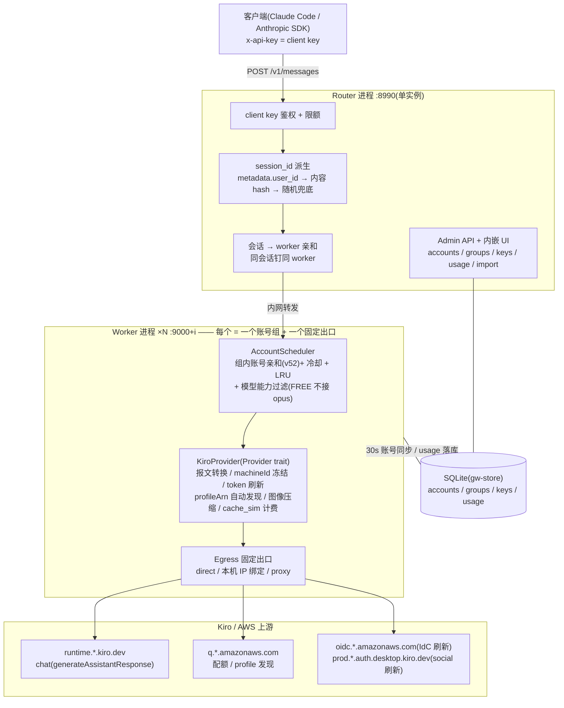
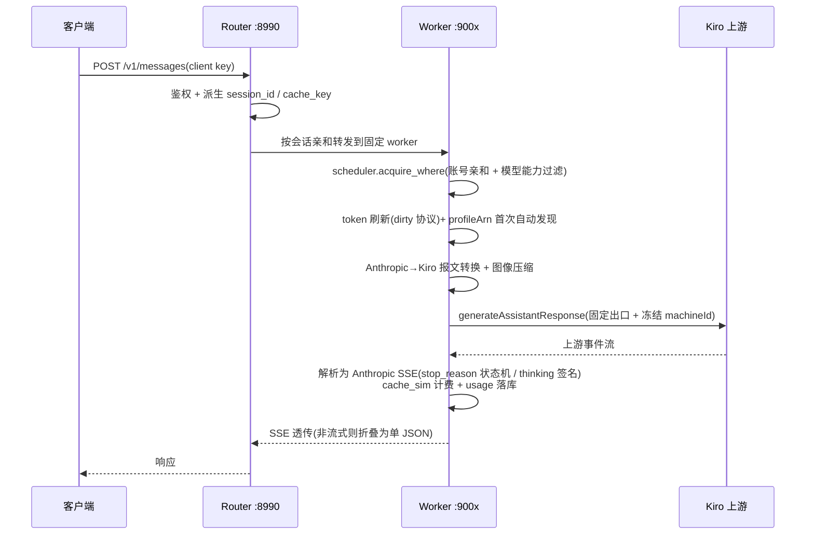
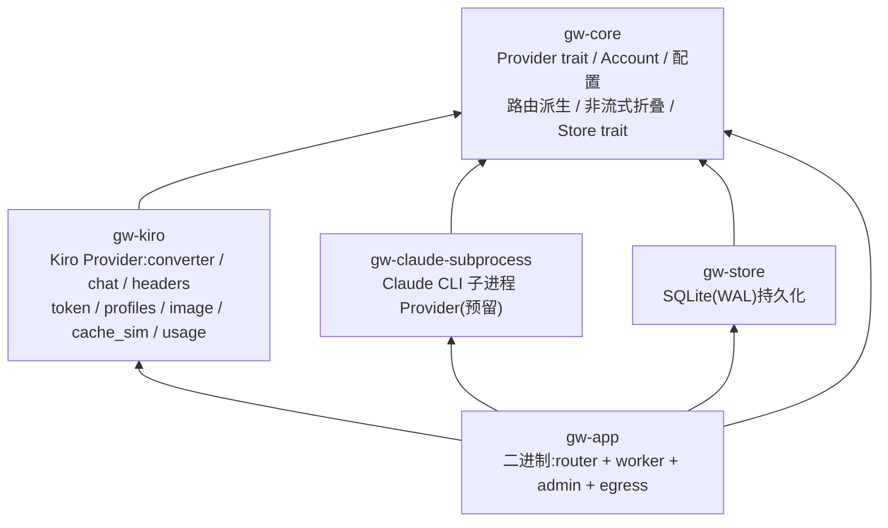

# Claude All in One

多进程 Claude 网关:对外暴露 Anthropic Messages API,对内把请求调度到一组上游账号(当前 Provider 为 Kiro/CodeWhisperer,架构上可插其他 Provider)。三个核心目标:

- **缓存命中** —— 会话两级亲和(session→worker→账号),同一会话始终落在同一出口、同一账号,最大化上游 prompt cache;
- **防关联** —— 每个 worker 进程绑定独立出口(本机多 IP / 代理)+ 账号 machineId 冻结 + 报文逐字对齐官方客户端;
- **可运营** —— 内嵌 admin 控制面(账号/分组/key/用量),双口径计费统计(真实 vs 模拟缓存)。

## 总体架构

单二进制 `claude-all-in-one`,按 `--mode` 分两种角色,多进程部署:



**为什么 router/worker 分进程**:出口 IP、账号组、上游连接池都按 worker 隔离 —— 一个 worker 内的账号永远从同一出口发包,不同账号组之间互不关联;router 只做鉴权与会话粘连,无上游状态,可独立重启。

## 一次请求的生命周期



## Crate 结构



| Crate | 职责 |
|---|---|
| `gw-core` | 与 Provider 无关的地基:`Provider` trait、账号模型、`SchedulerConfig` 等配置、session/cache key 派生、流式→非流式折叠。写一个 Provider 实现即可插一个 worker。 |
| `gw-kiro` | Kiro 上游全量实现:Anthropic↔Kiro 报文转换、防封报文头(machineId 冻结)、IdC/social 双轨 token 刷新、`ListAvailableProfiles` 动态 profileArn 发现、KiroManager 完整导入、图像压缩(OOM 护栏)、模拟缓存计费。 |
| `gw-store` | SQLite 持久化:账号/分组/client key/双口径用量统计。 |
| `gw-app` | 可执行文件:`--mode router`(鉴权 + 会话粘连 + admin)/ `--mode worker --instance N`(调度 + 上游)。admin UI 构建产物内嵌进二进制。 |
| `gw-claude-subprocess` | 拉起官方 Claude CLI 子进程的 Provider(NDJSON 事件流),预留。 |

## API 面

| 端点 | 角色 | 说明 |
|---|---|---|
| `POST /v1/messages` | router→worker | Anthropic Messages,流式/非流式 |
| `POST /v1/messages/count_tokens` | router | 本地估算,不打上游 |
| `GET /v1/models` | router→worker | 模型列表 |
| `/admin/api/*` | router | accounts / groups / keys / usage / import / reset(admin token 鉴权) |
| `GET /health` | both | worker 版含各账号运行态 + 配额缓存 |

## 运行

```bash
# 配置:复制 example 并填写(真实配置已 gitignore)
cp config/system.example.yaml config/system.yaml
cp config/instances.example.yaml config/instances.yaml

cargo build --release
./target/release/claude-all-in-one --mode router
./target/release/claude-all-in-one --mode worker --instance 0
```

前端开发:`cd admin-ui && bun install && bun run build`(产物内嵌进 router 二进制)。

测试:`cargo test --workspace`。

## 演进记录

版本级变更与设计取舍见 [CHANGELOG.md](CHANGELOG.md)。
